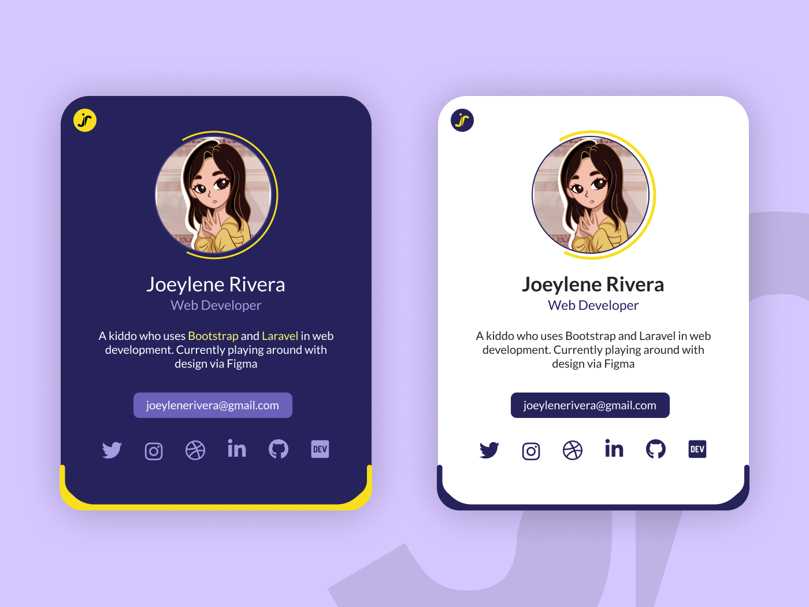

# Profile Card Task

- Create a two side profile card  

Sample Profile Card

### Submission Guide
- clone this repository
- checkout to a folder with your first name
- after pushing to github, create a Pull Request (PR)

### Resource:
[How to clone a repository](https://docs.github.com/en/repositories/creating-and-managing-repositories/cloning-a-repository)

[How to create a Pull Request](https://docs.github.com/en/desktop/contributing-and-collaborating-using-github-desktop/working-with-your-remote-repository-on-github-or-github-enterprise/creating-an-issue-or-pull-request)