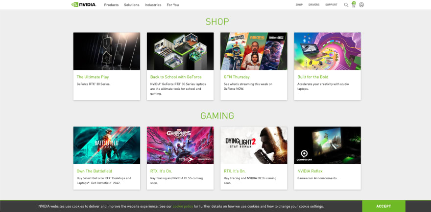

# Simple Web Page Task

Create a simple (single) HTML page that has the following properties:

**- Header**
  - A top bar (or menu, with clickable items) with:
  - A logo on the left side
  - At least two icons on the far right side 
  - At least three menu items
  
**- A grid:**
  - At least four columns
  - At least two rows
  - Each (cell) should have an image, text title and description
  - The text title should be clickable. 
  
**- A footer with**
  - copyright content
  - a button

**- Styling**
  - Use a simple style.css file to apply the style

**- Create a GitHub Repository**
  - add a description of the language used
  - push the code to GitHub

TIPS:
Read up [Grid](https://www.w3schools.com/css/css_grid.asp)

SAMPLE:

